# System Architecture

This document visualizes the high-level architecture of the Workout Tracker application.

## 🏗️ Architecture Diagram

```mermaid
graph TD
    %% Styling
    classDef client fill:#e1f5fe,stroke:#01579b,stroke-width:2px;
    classDef network fill:#f5f5f5,stroke:#9e9e9e,stroke-width:1px,stroke-dasharray: 5 5;
    classDef cloud fill:#e8f5e9,stroke:#2e7d32,stroke-width:2px;
    classDef database fill:#fff8e1,stroke:#ff8f00,stroke-width:2px;

    subgraph ClientLayer ["📱 Mobile Client Layer (Your Phone)"]
        direction TB
        AppShell["React Native App Shell<br/>(Expo Go / APK)"]:::client
        
        subgraph FrontendLogic ["Frontend Logic"]
            UI["UI Screens (React)"]:::client
            State["State Manager (Zustand)"]:::client
            Storage["Local Persistence<br/>(AsyncStorage)"]:::client
        end
        
        AppShell --> UI
        UI -->|User Action| State
        State <-->|Save Token| Storage
    end

    subgraph NetworkLayer ["🌐 Internet"]
        HTTPS["HTTPS / TLS Encrypted <br/> REST API Calls"]:::network
    end

    subgraph CloudLayer ["☁️ Cloud Infrastructure (Render.com)"]
        direction TB
        
        LoadBalancer["Render Load Balancer"]:::cloud

        subgraph BackendService ["Backend Micro-Components (Node.js)"]
            Server["Express Server Entry"]:::cloud
            
            subgraph Modules ["Logic Modules"]
                AuthService["🔐 Auth Service<br/>(JWT Handling)"]:::cloud
                ProfileService["👤 Profile Service<br/>(User Data)"]:::cloud
                ProtocolService["🏋️ Protocol Service<br/>(Workouts)"]:::cloud
            end
        end

        subgraph DataLayer ["Database (PostgreSQL)"]
            DB[(Primary Database<br/>Postgres 16)]:::database
        end
    end

    %% Connections
    State -->|API Request| HTTPS
    HTTPS -->|Port 443| LoadBalancer
    LoadBalancer -->|Forward| Server
    
    Server --> AuthService
    Server --> ProfileService
    Server --> ProtocolService
    
    AuthService <-->|Read/Write Users| DB
    ProfileService <-->|Read/Write Profiles| DB
    ProtocolService <-->|Read/Write Workouts| DB
```

---

## 🧩 Component Breakdown

### 1. Client Layer (The Frontend)
*   **React Native UI**: The visible interface built with Components.
*   **Zustand Store**: The "Brain" of the frontend. It holds data (like your profile) in memory so the app feels fast.
*   **AsyncStorage**: A tiny file on the phone where we save the **JWT Token**. This acts like a "Session Cookie" so the user stays logged in even if they close the app.

### 2. Network Layer
*   **REST API**: We use standard HTTP methods (`GET`, `POST`, `PUT`, `DELETE`) to communicate.
*   **JSON**: The language used for these messages.

### 3. Cloud Layer (The Backend)
Although hosted as a single "Monolithic" service (to save costs), the code is structured into logical **Micro-components**:

*   **Auth Service (`auth.ts`)**:
    *   **Responsibility**: Validates credentials, hashes passwords (using `bcrypt`), and issues ID badges (JWTs).
    *   **Security**: Ensures no one can fake their identity.
*   **Profile Service (`profile.ts`)**:
    *   **Responsibility**: Manages user demographics and avatar data.
    *   **Logic**: Handles data sanitization (like rounding height/weight).
*   **Protocol Service (`protocols.ts`)**:
    *   **Responsibility**: The core feature. Manages complex relationships between Protocols -> Exercises -> Metrics.
    *   **Transaction Management**: Uses SQL Transactions (`BEGIN`, `COMMIT`, `ROLLBACK`) to ensure that a workout routine is saved completely or not at all (no half-saved broken data).

### 4. Data Layer
*   **PostgreSQL**: A relational database chosen for its reliability and strict schema enforcement.
*   **Relationships**: Connects Users to their specific Workouts via Foreign Keys (`user_id`).
